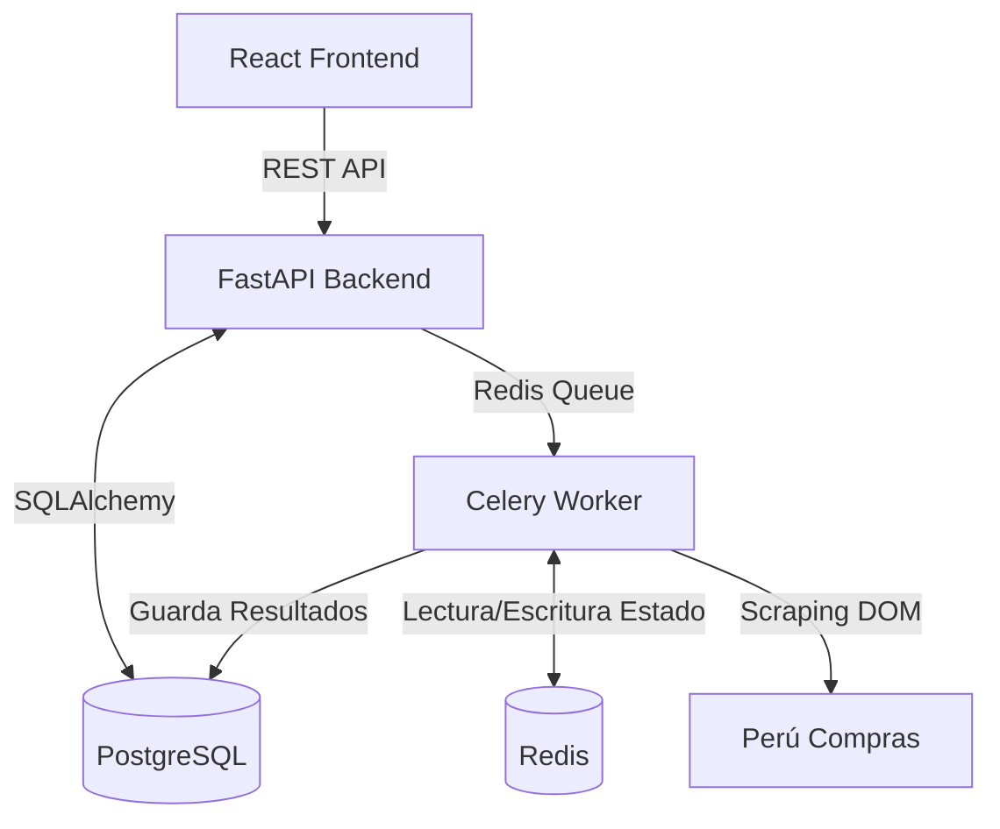

# 📖 Arquitectura e Implementación: CEAM AUDITOR 2.0

Este documento sirve como guía comprensiva de la arquitectura y decisiones técnicas implementadas en el proyecto **CEAM AUDITOR 2.0**. Está diseñado para proporcionar un contexto claro a futuros desarrolladores o asistentes de IA (IAs) que necesiten modificar, escalar o depurar el sistema.

---

## 🏛️ 1. Arquitectura General del Sistema

El sistema sigue una arquitectura moderna, basada en microservicios contenerizados, con una separación clara entre el Cliente (Frontend), el Servidor de API (Backend), la Base de Datos y los Workers de Tareas en segundo plano.

### Flujo de Datos

---

## ⚙️ 2. Backend (FastAPI & Celery)

El backend está construido con **FastAPI** para alta concurrencia y autogeneración de documentación (Swagger), y **SQLAlchemy** (v2) como ORM principal.

### 2.1. Estructura de Directorios

El backend sigue una estructura modular estándar para FastAPI:
- `app/api/endpoints/`: Controladores. Definen las rutas de la API, manejan la validación de entrada/salida a través de Pydantic y llaman a los servicios.
- `app/core/`: Configuraciones (`settings.py`), constantes y validaciones core.
- `app/db/`: Instanciación de la conexión a DB (`session.py`) y migraciones base.
- `app/models/`: Modelos de la Base de datos (SQLAlchemy). Determinan las tablas reales.
- `app/schemas/`: Modelos Pydantic. Sirven para la estipulación estricta de cómo entran (Creación) y cómo salen (Retorno de API) los datos.
- `app/services/`: Lógica de Negocio Central (`crud.py`). Se separan las rutas de las consultas directas a base de datos.
- `app/tasks/`: Lógica pesada y asíncrona (Scrapers, reportes). Funciones enviadas al worker `celery`.

### 2.2. Diseño de Base de Datos y Modelos

#### Entidad Core: `PurchaseOrder` (`app/models/purchase_order.py`)
Decidimos usar una sola entidad robusta para guardar todos los datos que extrae el scraper desde Perú Compras, ya que el sistema tiene una necesidad primordial: la consulta plana en formato columnar para el dashboard.

**Campos Clave Implementados:**
- **Datos de la orden**: `nro_orden_fisica` (Unique/Indexado), `fecha_publicacion` (DateTime p/ filtros en el dashboard).
- **Entidades involucradas**: `nombre_entidad`, `ruc_entidad` (Cliente), `nombre_proveedor`, `ruc_proveedor` (Proveedor).
- **Detalle Financiero**: `monto_total` (Numeric 14,4), `sub_total`, `igv`. Guardados como Numeric para permitir agregaciones exactas en SQL.
- **Catálogo**: `catalogo`, `acuerdo_marco`, `categoria`, `plazo_entrega_dias`.
- **Metadatos del Documento**: `pdf_url` (link al certificado original), `estado_orden` (Estado del contrato).
- **Campos añadidos (Abril 2026)**:
  - `orden_digitalizada` (TEXT, nullable) — URL al PDF digitalizado de la orden física, extraído de la columna "Orden Digitalizada" del Excel.
  - `nro_parte` (TEXT, nullable) — número de parte/SKU del ítem.
  - `precio_unitario` (NUMERIC 14,4, nullable) — precio por unidad del ítem.

**Patrón de auto-migración en `main.py`:** Las columnas nuevas se añaden automáticamente al arranque de la API sin necesidad de Alembic. El bloque `_NEW_COLS` define tuplas `(tabla, columna, tipo_sql)`. Al iniciar, se consulta `information_schema.columns`; si la columna no existe, se ejecuta `ALTER TABLE ... ADD COLUMN ...`. Esto permite despliegues sin downtime ni scripts manuales.

#### Entidad Fichas: tabla dinámica `fichas_produto` (o variante con tilde)
Generada automáticamente por `fichas_scraper.py` al procesar el Excel de fichas del portal. Las columnas dependen del Excel (no hay modelo SQLAlchemy fijo). Se utiliza un esquema **schemaless** con descubrimiento dinámico de columnas vía `information_schema.columns`. Las columnas VARCHAR existentes se migran a TEXT automáticamente en cada upsert usando `sa_inspect` + `ALTER COLUMN ... TYPE TEXT` para evitar `StringDataRightTruncation`.

### 2.3. APIs Implementadas (`app/api/endpoints/`)

#### A. Endpoint de Extracción — Órdenes (`scraper.py`)
Maneja la ejecución controlada del scraper de órdenes de compra (Módulo 1).
- `POST /scraper/run`: Inicializa la tarea de Playwright de fondo mandándola a la cola de **Celery**. Acepta parámetros `fecha_inicio`, `fecha_fin`, `catalogo` (código EXT/IM del acuerdo marco) y `max_pages`. Retorna inmediatamente un `task_id`.
- `GET /scraper/status/{task_id}`: Polling del estado de la tarea Celery. Retorna `state`, `meta.current`, `meta.total`, `meta.inserted`, `meta.updated`.
- `GET /scraper/catalogos`: Retorna la lista de acuerdos marco disponibles como objetos `{code, label}`. El `code` es el identificador exacto del acuerdo (ej. `EXT-CE-2022-5`) que se usa para la búsqueda en el Select2 del portal. Usar `code` (no `label`) como valor del filtro.
- `GET /scraper/test-download`: Diagnóstico — ejecuta el scraper **directamente en el proceso API** (sin Celery) y retorna JSON de traza. Disponible en Swagger `/docs`.

**`CATALOGOS_DISPONIBLES`** — lista de 16 acuerdos marco vigentes con formato `{code, label}`. Los códigos exactos (`EXT-CE-2022-5`, `EXT-CE-2021-6`, `IM-CE-2023-1`, etc.) se obtuvieron del HTML del portal. **No usar keywords genéricas** — el Select2 del portal sólo acepta coincidencia exacta con el texto de la opción.

#### B. Endpoint de Órdenes (`purchase_orders.py`)
Provee métodos de listado y analíticas.
- `GET /purchase-orders/`: Listado paginado con filtros: `search` (texto libre sobre entidad/proveedor/nro_orden), `catalogo`, `estado`, `fecha_inicio`, `fecha_fin`, `skip`, `limit`.
- `GET /purchase-orders/stats`: Endpoint **agregador** para el Dashboard. Retorna KPIs: total órdenes, monto total adjudicado, top entidades, distribución por catálogo y por estado. Usa `func.sum()` y `func.count()` directo en PostgreSQL.
- `GET /purchase-orders/catalogos-filter`: Retorna la lista de valores distintos de `catalogo` que existen en la DB (no-null, ordenados). Usado por `Orders.jsx` para poblar dinámicamente el dropdown de filtro — **no hardcodear opciones**.
- `GET /purchase-orders/{id}`: Detalle de una orden por ID.

#### C. Endpoint de Fichas (`fichas.py`)
Expone las fichas técnicas extraídas por el scraper de fichas (Módulo 2).
- `GET /fichas/`: Listado paginado con filtros: `search`, `estado`, `marca`, `acuerdo_marco`, `catalogo`, `categoria`. Usa SQL dinámico con descubrimiento de columnas via `information_schema`.
- `GET /fichas/stats`: Estadísticas agregadas: `total_fichas`, `by_acuerdo`, `by_categoria`, `by_estado`, `by_marca`. Alimenta el panel de KPIs de Fichas en el Dashboard.

### 2.4. Workers & Scrapers

#### Módulo 1 — Scraper de Órdenes (`app/services/scraper.py` + `app/worker/tasks.py`)
Extrae órdenes de compra del portal Perú Compras como Excel y las guarda en `purchase_orders`.
- Utiliza `playwright.async_api` con `asyncio`.
- Navega los frames ASP.NET, configura filtros de fecha y catálogo, descarga el Excel detallado.
- Procesamiento ETL con `pandas`: limpieza de cabeceras (regex `_x000d_`), detección dinámica de `header_row_idx`, deduplicación por `nro_orden_fisica`, mapeo de columnas via `col_map`.
- **`col_map`** — diccionario que mapea nombre-semántico → índice de columna Excel. Cubre todos los campos del modelo incluidos los nuevos: `orden_digitalizada`, `nro_parte`, `precio_unitario`.
- Upsert idempotente: si `nro_orden_fisica` ya existe → `UPDATE`; si no → `INSERT`.
- Actualiza el estado Celery en Redis: `self.update_state(state='PROGRESS', meta={'current': page, 'total': max_pages, 'inserted': n, 'updated': m})`.

#### Módulo 2 — Scraper de Fichas (`app/services/fichas_scraper.py`)
Extrae fichas técnicas de productos del portal y las guarda en la tabla `fichas_produto` (nombre variable según encoding del portal).
- Descarga Excel de fichas por acuerdo marco, procesa con pandas.
- `upsert_fichas()`: crea la tabla dinámicamente con `meta.create_all()`. Incluye auto-migración para columnas VARCHAR existentes → TEXT (usando `sa_inspect` + `ALTER COLUMN ... TYPE TEXT`) para evitar `StringDataRightTruncation` en columnas largas.
- Identificador de upsert: columna `codigo_ficha` o equivalente.

---

## 🎨 3. Frontend (React 19 + Vite)

El cliente web ha sido construido bajo un estándar de calidad **altamente estético**, emulando patrones de desarrollo premium.

### 3.1. Stack Tecnológico Frontend
- **Framework**: React 19 (Componentes funcionales puros).
- **Builder**: Vite (Permite HMR relámpago).
- **Estilos**: Vainilla CSS + CSS Modules. Se priorizó el desarrollo sin herramientas sobrecargadas para un control completo de la UI, emulando estilos "Glassmorphism" con variables HSL sólidas y temas dinámicos oscuros/vibrantes.
- **Iconografía**: `lucide-react`.

### 3.2. Estructura de Interfaz

La vista se organiza con el patrón `Layout` → `Páginas`. La navegación vive en `Sidebar.jsx`.

**Rutas activas (`App.jsx`):**
| Ruta | Componente | Descripción |
|---|---|---|
| `/` | `Dashboard.jsx` | KPIs de órdenes + fichas, tabla Top Marcas |
| `/orders` | `Orders.jsx` | Tabla filtrable de órdenes de compra |
| `/fichas-catalogo` | `Fichas.jsx` | Tabla filtrable de fichas técnicas |
| `/scraper` | `ScraperControl.jsx` | Panel de control scraper Módulo 1 |
| `/fichas` | `ScraperControl.jsx` (modo fichas) | Panel de control scraper Módulo 2 |

**Páginas:**
- **`Dashboard.jsx`**: Centro neurálgico. Llama `Promise.allSettled([purchaseOrdersApi.getStats(), fichasProductoApi.getStats()])`. Muestra dos secciones de KPI: "Órdenes de Compra" (4 tarjetas) y "Fichas Producto" (4 tarjetas), más una tabla Top Marcas con datos de fichas. Usa `recharts` para gráficas de distribución por catálogo.
- **`Orders.jsx`**: Tabla interactiva. Filtros: búsqueda de texto libre, fecha inicio/fin, catálogo (dropdown dinámico cargado desde `GET /purchase-orders/catalogos-filter` — **no hardcodear opciones**). Paginación con 25 items/página. Delega el render de filas a `OrderTable.jsx`.
- **`OrderTable.jsx`**: Columnas actuales: `Nro. Orden | Entidad | Proveedor | Publicación | Nro. Parte | P. Unitario | Monto (PEN) | Estado | Doc`. El botón "Doc" usa `orden_digitalizada` (con atributo `download`) y hace fallback a `pdf_url` si el anterior es null.
- **`Fichas.jsx`**: Vista de catálogo de fichas técnicas. Filtros: texto libre, estado (VIGENTE/SUSPENDIDA/ELIMINADA), marca. Paginación 25 items/página. Delega a `FichasTable.jsx`.
- **`FichasTable.jsx`**: Columnas detectadas dinámicamente desde las claves del primer objeto. Muestra: Nro. Parte/Código, Descripción (truncada con tooltip), Marca, Categoría, Estado (badge), PDF ficha técnica, imagen si disponible.
- **`ScraperControl.jsx`**: Panel de control unificado para Módulo 1 y Módulo 2. Dropdown de catálogo usa `{code, label}` — el `code` (EXT/IM) se envía al backend; el `label` es para display. Polling con `setInterval` cada 2s sobre `GET /scraper/status/{task_id}`.

### 3.3. Manejo de Tareas Asíncronas (Polling)
Implementado en `ScraperControl.jsx`:
1. El usuario configura catálogo + rango de fechas y hace clic en "Iniciar".
2. Se ejecuta `POST /scraper/run` (o el endpoint correspondiente al módulo).
3. Se recibe `task_id` y se almacena en estado local.
4. Arranca un `setInterval` cada 2s que llama `GET /scraper/status/{task_id}`.
5. El progreso se muestra con barra de avance: `meta.current / meta.total * 100`.
6. Al recibir `state === 'SUCCESS'` o `state === 'FAILURE'`, se limpia el interval y se muestra el mensaje final (insertados/actualizados o mensaje de error).

**Importante:** Los errores del scraper **deben propagarse** (lanzar `RuntimeError`, nunca `return None`) para que Celery marque la tarea como `FAILURE` y el frontend pueda mostrar el mensaje de error.

---

## 🛳️ 4. Infraestructura y Despliegue (Docker)

El proyecto entero usa Docker Compose y ha sido pensado para correr en **Dokploy**.

### 4.1. Archivos Clave
- `backend/Dockerfile`: Se construyó bajo una base de Python 3.12 (slim o convencional). A tener en cuenta: El contenedor de backend instala adicionalmente `playwright install --with-deps chromium` en el área de compilación, que incrementa en ciertos % el tamaño de la imagen final, pero previene problemas de falta de librerías SO necesarias para abrir los navegadores *headless*.
- `frontend/Dockerfile`: Un build de *multi-stage*:
  1. *Build stage*: Construye los ficheros de NodeJS (`npm run build`).
  2. *Serve stage*: Inicia un micro servidor estático (como `nginx:alpine` o global `serve`), copiando unívocamente la carpeta `dist`. De esta manera, el tamaño de final del contenedor de frontend es de unos escasos ~30MB.
- `docker-compose.yml`: Coordina **5 servicios**:
   - `db` (Postgres)
   - `redis` (Cache/Broker)
   - `backend` (API Uvicorn)
   - `celery_worker` (El ejecutor de tareas)
   - `frontend` (Host del HTML/JS estático)

### 4.2. Gotchas de Variables de Entorno (Dokploy)
Para poder comunicarse de un Frontend desplegado hacia el Backend remoto sin fallar en errores de red C.O.R.S o Not Found, es crucial la variable:
`VITE_API_URL`
Ya que el Frontend vive en el navegador del cliente externo (y no internal-network de Docker), dicha variable en momento de *Build* necesita apuntar a un **dominio web o IP externo público**, NO al local de contenedor `http://backend:8087`. Este es el fallo más común en los pases a Dokploy.

---

## 📝 5. Resumen Ejecutivo (Tl;dr) para Inteligencias Artificiales (IAs)

Si se debe modificar el proyecto en el futuro:

- **Para añadir un campo nuevo a `purchase_orders`**:
  1. `app/models/purchase_order.py` — añadir columna SQLAlchemy.
  2. `app/schemas/purchase_order.py` — añadir campo Pydantic en `PurchaseOrderBase`.
  3. `app/services/scraper.py` — añadir entrada en `col_map` + pasar el valor en `PurchaseOrderCreate(...)`.
  4. `app/main.py` — añadir la tupla `("purchase_orders", "nombre_col", "TIPO_SQL")` en `_NEW_COLS` para auto-migración al arranque.
  5. `frontend/src/components/orders/OrderTable.jsx` — añadir la columna en la tabla.

- **Para añadir un nuevo acuerdo marco scrapeble**:
  - Ir a `app/api/endpoints/scraper.py`, añadir `{"code": "EXT-CE-XXXX-X", "label": "..."}` en `CATALOGOS_DISPONIBLES`. El `code` debe ser el identificador exacto del acuerdo en el portal (visible en el HTML del Select2).

- **Para el scraper de fichas**: El código está en `app/services/fichas_scraper.py`. La tabla `fichas_produto` es schemaless (columnas dinámicas). No añadir un modelo SQLAlchemy fijo — mantener el patrón de descubrimiento dinámico.

- **Para cambiar el aspecto visual**: Las variables CSS viven en `frontend/src/index.css` (variables `:root` HSL). No usar TailwindCSS — la estructura ligera es intencional.

- **Para arreglos o fallos de Despliegue Dokploy**:
  - Puertos expuestos: `8087` (API), `3087` (Frontend) — definidos en `docker-compose.yml`.
  - `VITE_API_URL` debe apuntar al dominio público externo (`https://api-auditor.sekaitech.com.pe`), NO al nombre de red interno (`http://backend:8087`).
  - Tras cambios en el scraper, **reiniciar `ceam_worker`** en Dokploy (el worker Celery no detecta cambios de archivo).

- **Para diagnóstico de errores del scraper**: Usar `GET /scraper/test-download` desde Swagger `/docs` — ejecuta el scraper sin Celery y retorna JSON de traza completa.

---

## 🔍 6. Lecciones Aprendidas y Depuración del Scraper (Abril 2026)

Durante la implementación del scraper para el catálogo de **Computadoras de Escritorio**, se identificaron y resolvieron varios obstáculos críticos que deben ser respetados por cualquier IA o desarrollador futuro:

### ⚡ 6.1. Comportamiento del Portal Perú Compras (ASP.NET)
1. **Carreras de Datos (Race Conditions)**: El portal utiliza `UpdatePanels` de ASP.NET. Acciones como marcar el Checkbox **"Exportar Detallado"** disparan recargas asíncronas invisibles. Si el robot hace clic en "Buscar" inmediatamente, la sesión se corrompe. **Solución:** Introducir `wait_for_timeout(2000)` tras interacciones de configuración de filtros.
2. **El Engaño de la Clase `tr.FilaDatos`**: No se debe confiar únicamente en la aparición de filas con esta clase para saber si una búsqueda terminó. El portal tiene una tabla de "Datos Históricos" (ej: Enero 2023) al pie de página que usa la misma clase. El robot puede creer que la búsqueda terminó en 0 segundos al detectar esa otra tabla. **Solución:** Forzar `wait_for_load_state("networkidle")` con un timeout generoso (90s) para asegurar que el AJAX real de la búsqueda terminó.
3. **Inputs de Tipo Date**: El navegador Chromium (Playwright) exige estrictamente el formato `YYYY-MM-DD` para el método `.fill()` en elementos `<input type="date">`. Usar `DD/MM/YYYY` hará que el valor se rechace silenciosamente, resultando en búsquedas sin rango de fecha (0 resultados).
4. **Playwright dentro de Docker**: Chromium no puede lanzarse como `root` sin flags especiales. **Solución obligatoria** al construir el browser dentro de contenedores Docker/Linux: pasar `args=["--no-sandbox", "--disable-setuid-sandbox", "--disable-dev-shm-usage", "--disable-gpu"]` a `playwright.chromium.launch()`. Sin esto el browser crashea silenciosamente y `_download_excel` retorna `None`.
5. **Botón de exportación con `href: #`**: El link `#aExportarXLSX` tiene `href="#"` (JS-driven). Playwright no puede hacer click directo si detecta restricciones. **Solución:** Usar `await xlsx_link.evaluate("node => node.click()")` para forzar el click a nivel DOM, evitando validaciones de Playwright.

### 📊 6.2. Procesamiento de Excel (Pandas ETL)
1. **Limpieza de Cabeceras**: Los archivos Excel generados por el portal contienen marcadores XML de retorno de carro (`_x000d_`) y saltos de línea (`\n`) dentro de los nombres de las columnas. Esto rompe el mapeo de columnas (ej: "Nro Orden Física" → aparece como `"N_x000d_\nro Orden Física"`). **Solución:** Usar Regex para limpiar cabeceras: `df.columns.astype(str).str.replace(r"(_x[0-9a-fA-F]+_|\n|\r)", "", regex=True).str.strip()`.
2. **La Trampa del GroupBy**: Al usar `df.groupby(col).apply(merge_fn).reset_index(drop=True)` para eliminar duplicados, la columna que sirve de base para el grupo (ej: el Número de Orden) queda en el índice. Con `drop=True` se descarta creando una columna faltante; con `drop=False` se crea un duplicado. **Solución correcta:** Usar `reset_index(drop=True)` — el valor ya está presente como columna en el DataFrame resultado porque `_merge_group` retorna `group.iloc[0]` que incluye la columna de agrupamiento.
3. **Fila de Cabecera Dinámica**: El Excel descargado no tiene las cabeceras reales en la fila 0. Tiene varias filas de metadatos (título "Datos Abiertos Reporte Detallado de Ordenes", fechas de exportación, etc.) antes de los encabezados reales. `skiprows=5` funcionaba accidentalmente en versiones antiguas del formato. **Solución robusta:** Escanear las primeras 20 filas con `pd.read_excel(filepath, header=None, nrows=20)` y encontrar la primera fila que contenga simultáneamente palabras clave como `"nro"` y `"proveedor"`. Usar ese índice como `skiprows`. Implementado en `_process_excel()`.
4. **Columnas de Dos Niveles (Orden vs. Entrega)**: El Excel contiene columnas financieras en DOS NIVELES:
   - **Nivel Orden** (filas ~17-19 del encabezado): `"Sub Total Orden Electrónica"`, `"IGV Orden Electrónica"`, `"Total Orden Electrónica"` — representan el **total real de la orden**.
   - **Nivel Entrega** (filas ~51-53): `"Sub Total"`, `"IGV Entrega"`, `"Monto Total Entrega"` — representan el monto de **una entrega individual** de la orden.
   Como las columnas de entrega aparecen **después** en la iteración del loop de `col_map`, sobreescriben los valores correctos de orden. **Solución:** En el `col_map`, usar lógica de prioridad: setear `sub_total`/`igv`/`monto_total` siempre cuando el nombre contiene `"orden"` (columna de nivel orden), e ignorar columnas posteriores si ya están mapeadas sin `"orden"`.

### 🛡️ 6.3. Errores Silenciosos y CORS
1. **Errores Atrapados → 0 resultados**: En iteraciones previas, todo `except` en `_download_excel` ejecutaba `return None`. Esto hacía que la tarea Celery terminara como `SUCCESS {"inserted":0,"updated":0}`, imposible de diagnosticar. **Solución:** Todos los bloques de error ahora lanzan `RuntimeError` con mensaje descriptivo en español.
2. **CORS en Errores 500**: El `ServerErrorMiddleware` de Starlette rodea al `CORSMiddleware` en el stack ASGI. Si un endpoint lanza una excepción sin atrapar, la respuesta 500 NO lleva el header `Access-Control-Allow-Origin`, y el frontend ve un `net::ERR_FAILED` en vez del error real. **Solución:** Envolver TODO el cuerpo de los endpoints del scraper en `try/except` que retornan JSON con el error (nunca relanzar hacia afuera), y usar `result.get(propagate=False)` al consultar resultados de tareas Celery fallidas.

### 🛠️ 6.4. Herramientas de Diagnóstico
Se inyectó una lógica de `debug_info` en el endpoint `GET /api/v1/scraper/test-download`. Este endpoint ejecuta el scraper **directamente en el proceso API** (sin Celery), retorna JSON con el resultado completo y traza de error si falla. Úsalo desde Swagger `/docs`.

Si el scraper falla o retorna datos incorrectos, revisar:
- `rows_on_screen`: Si es 10 o un número bajo, el robot probablemente leyó la tabla de pie de página de 2023 antes de que cargaran los datos reales.
- `first_row_text`: Si contiene `"2023Enero"`, el robot actuó antes de que la página cargara los resultados reales.
- `link_diagnostics.href`: Si es `#`, el link es JS-driven — usar `evaluate("node => node.click()")` (ya implementado).
- `orders_parsed` = 0 con `phase: excel_processing`: revisar limpieza de cabeceras y detección dinámica de `header_row_idx`.
- `inserted: 0, updated: N` en segunda ejecución: **comportamiento correcto** — los registros ya existen del run anterior.

### ♻️ 6.5. Ciclo de Despliegue y el Worker de Celery
**CRÍTICO:** El worker de Celery importa todos los módulos Python **una sola vez al arrancar**. A diferencia de uvicorn (que tiene `--reload`), el worker **nunca detecta cambios en archivos**. Después de hacer cualquier push con cambios en `app/services/scraper.py` o `app/worker/tasks.py`, es **obligatorio reiniciar el contenedor `ceam_worker`** en Dokploy para que el código nuevo tenga efecto. Si no se reinicia, el worker seguirá usando la versión antigua del scraper, resultando en `{"inserted":0,"updated":0}`.

---

## 🗓️ 7. Registro de Cambios — Abril 2026

### 7.1. Nuevos Campos en `purchase_orders`
Se añadieron tres columnas nullable a la tabla `purchase_orders` para enriquecer la información de cada orden:
- **`orden_digitalizada`** (TEXT): URL al PDF de la orden física digitalizada. Mapea a la columna "Orden Digitalizada" del Excel del portal.
- **`nro_parte`** (TEXT): Número de parte / SKU del ítem.
- **`precio_unitario`** (NUMERIC 14,4): Precio por unidad del ítem.

Las columnas se crean automáticamente al arranque de la API via el bloque `_NEW_COLS` en `main.py` (patrón de auto-migración sin Alembic). Los archivos afectados: `models/purchase_order.py`, `schemas/purchase_order.py`, `services/scraper.py`, `main.py`, `components/orders/OrderTable.jsx`.

### 7.2. Selector de Catálogo — Scraper Módulo 1
`CATALOGOS_DISPONIBLES` se migró de lista de keywords genéricas a lista de objetos `{code, label}`. El `code` (ej. `EXT-CE-2022-5`) es el identificador exacto del Select2 del portal. Se extrajo el listado completo de los 16 acuerdos marco vigentes del HTML del portal. El frontend (`ScraperControl.jsx`) usa `c.code` como valor del `<select>` y `c.label` como texto visible.

### 7.3. Filtro de Catálogo Dinámico en Orders
Antes, `Orders.jsx` tenía opciones de catálogo hardcodeadas (incorrectas). Ahora:
- Nuevo endpoint `GET /purchase-orders/catalogos-filter` devuelve los valores `catalogo` distintos existentes en DB.
- `Orders.jsx` carga las opciones desde la API al montar el componente.
- Nunca más hardcodear opciones de catálogo en el frontend.

### 7.4. Sistema de Fichas Técnicas (Módulo 2)
Se implementó el flujo completo de fichas técnicas:
- **Backend**: `app/services/fichas_scraper.py` extrae fichas del portal y hace upsert en tabla `fichas_produto`. Incluye auto-migración VARCHAR→TEXT al inicio de cada upsert via `sa_inspect`.
- **API**: `app/api/endpoints/fichas.py` — `GET /fichas/` (listado paginado/filtrado) y `GET /fichas/stats` (KPIs). Usa SQL dinámico con descubrimiento de columnas via `information_schema` (tabla schemaless).
- **Frontend**: `Fichas.jsx` (ruta `/fichas-catalogo`), `FichasTable.jsx` con columnas dinámicas, integración en `Sidebar.jsx` y `App.jsx`.
- **Dashboard**: Sección "Fichas Producto" con 4 KPIs + tabla Top Marcas.

### 7.5. `OrderTable.jsx` — Actualización de Columnas
La tabla de órdenes ahora muestra las 3 columnas nuevas. Orden de columnas:
`Nro. Orden | Entidad | Proveedor | Publicación | Nro. Parte | P. Unitario | Monto (PEN) | Estado | Doc`

El botón "Doc" usa `orden_digitalizada` (con `download`) con fallback a `pdf_url`. Si ambos son null muestra `—`.
