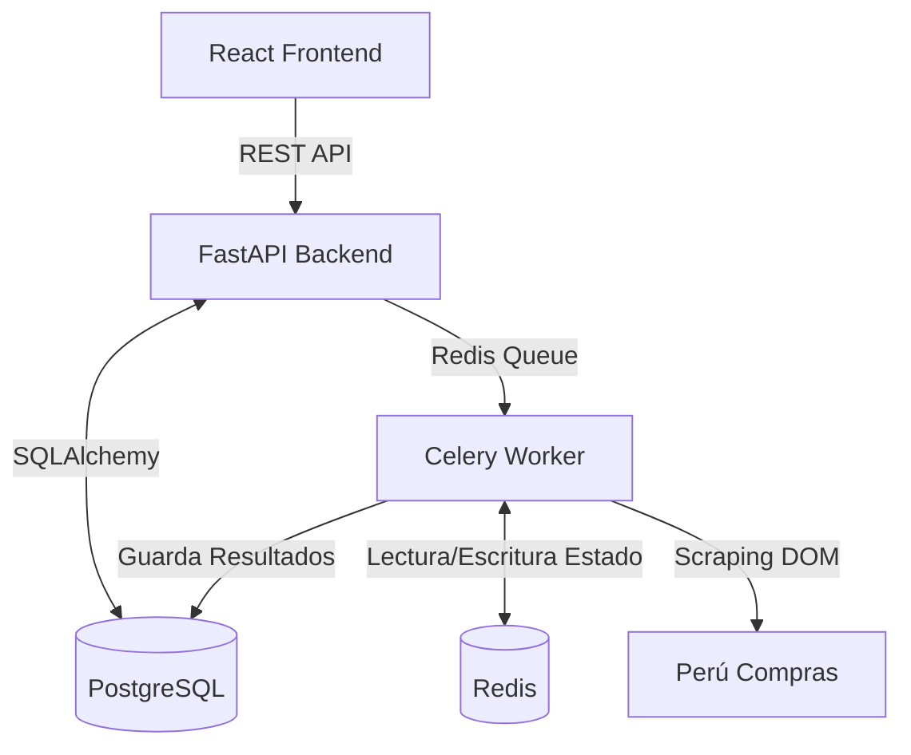

# 📖 Arquitectura e Implementación: CEAM AUDITOR 2.0

Este documento sirve como guía comprensiva de la arquitectura y decisiones técnicas implementadas en el proyecto **CEAM AUDITOR 2.0**. Está diseñado para proporcionar un contexto claro a futuros desarrolladores o asistentes de IA (IAs) que necesiten modificar, escalar o depurar el sistema.

---

## 🏛️ 1. Arquitectura General del Sistema

El sistema sigue una arquitectura moderna, basada en microservicios contenerizados, con una separación clara entre el Cliente (Frontend), el Servidor de API (Backend), la Base de Datos y los Workers de Tareas en segundo plano.

### Flujo de Datos

---

## ⚙️ 2. Backend (FastAPI & Celery)

El backend está construido con **FastAPI** para alta concurrencia y autogeneración de documentación (Swagger), y **SQLAlchemy** (v2) como ORM principal.

### 2.1. Estructura de Directorios

El backend sigue una estructura modular estándar para FastAPI:
- `app/api/endpoints/`: Controladores. Definen las rutas de la API, manejan la validación de entrada/salida a través de Pydantic y llaman a los servicios.
- `app/core/`: Configuraciones (`settings.py`), constantes y validaciones core.
- `app/db/`: Instanciación de la conexión a DB (`session.py`) y migraciones base.
- `app/models/`: Modelos de la Base de datos (SQLAlchemy). Determinan las tablas reales.
- `app/schemas/`: Modelos Pydantic. Sirven para la estipulación estricta de cómo entran (Creación) y cómo salen (Retorno de API) los datos.
- `app/services/`: Lógica de Negocio Central (`crud.py`). Se separan las rutas de las consultas directas a base de datos.
- `app/tasks/`: Lógica pesada y asíncrona (Scrapers, reportes). Funciones enviadas al worker `celery`.

### 2.2. Diseño de Base de Datos y Modelos

#### Entidad Core: `PurchaseOrder` (`app/models/purchase_order.py`)
Decidimos usar una sola entidad robusta para guardar todos los datos que extrae el scraper desde Perú Compras, ya que el sistema tiene una necesidad primordial: la consulta plana en formato columnar para el dashboard.

**Campos Clave Implementados:**
- **Datos de la orden**: `order_number` (Unique/Indexado), `issue_date` (DateTime p/ filtros en el dashboard).
- **Entidades involucradas**: `entity_name`, `ruc_entity` (Cliente), `provider_name`, `ruc_provider` (Proveedor).
- **Detalle Financiero**: `total_amount` (Guardado como Float, procesado desde strings p/ permitir agregaciones directas en SQL).
- **Metadatos**: `pdf_url` (Link directo al certificado original), `execution_status` (Estado del contrato).

### 2.3. APIs Implementadas (`app/api/endpoints/`)

#### A. Endpoint de Extracción (Scraper) `scraper.py`
Maneja la ejecución controlada de scraping.
- `POST /scraper/run`: Inicializa la tarea de Playwright de fondo mandándola a la cola de **Celery**. Se le puede pasar el parámetro dinámico `max_pages`. Retorna inmediatamente un `task_id` (patrón de Asincronismo de Respuesta Rápida).
- `GET /scraper/status/{task_id}`: Un endpoint crítico que permite al frontend consultar intermitentemente el estado (polling) o leer metadatos inyectados desde el worker (`meta={'progress':...}`).

#### B. Endpoint de Órdenes `orders.py`
Provee métodos de listado y analíticas.
- `GET /orders/`: Listado tradicional con paginación, pero enriquecido con **Filtros Flexibles** (fecha de inicio, fin, nombre de entidad, proveedor o RUC). Usa consultas LIKE/ILIKE y operadores lógicos.
- `GET /orders/stats`: Un endpoint **agregador** diseñado específicamente para el Dashboard de React.
  - Retorna KPIs inmediatos como "Total Adjudicado en Monto" (`sum(total_amount)`), y agrupados por "Catalogo" (`group_by(catalog)`).
  - *Decisión de Diseño:* Se hizo en backend para evitar que el frontend procese masivamente toda la tabla, delegando este rol pesado a la BD de PostgreSQL usando `func.sum()` y `func.count()`.

### 2.4. El Worker & Scraper (`app/tasks/scrapers.py`)
Es el motor donde transcurre la "magia sucia" de extracción.
- Utiliza `playwright.sync_api`.
- Se autentica (si es necesario) o navega por los frames complejos de ASP.NET antiguos de Perú Compras, maneja esperas explícitas (`wait_for_selector`) y recorre la paginación (`click("text='>>'")`).
- Por cada iteración, empuja los resultados usando `crud.create_order()`, utilizando un insert/update idempotente (en caso la OC ya exista, se ignora o actualiza para evitar duplicados, usando la validación de Integridad de sqlalchemy).
- En cada iteración clave actualiza el estado de la tarea en Redis para notificar al frontend:
  `self.update_state(state='PROGRESS', meta={'current': page, 'total': max_pages})`

---

## 🎨 3. Frontend (React 19 + Vite)

El cliente web ha sido construido bajo un estándar de calidad **altamente estético**, emulando patrones de desarrollo premium.

### 3.1. Stack Tecnológico Frontend
- **Framework**: React 19 (Componentes funcionales puros).
- **Builder**: Vite (Permite HMR relámpago).
- **Estilos**: Vainilla CSS + CSS Modules. Se priorizó el desarrollo sin herramientas sobrecargadas para un control completo de la UI, emulando estilos "Glassmorphism" con variables HSL sólidas y temas dinámicos oscuros/vibrantes.
- **Iconografía**: `lucide-react`.

### 3.2. Estructura de Interfaz

La vista se organiza con el patrón `Layout` -> `Páginas`:
- `Layout.jsx`: Encapsula la Sidebar navegable.
- **Páginas**:
  - `Dashboard.jsx`: El centro neurálgico. Hace el *fetching* directo a `/orders/stats`. Despliega KPIs (tarjetas superiores con micro animaciones visuales indicando subidas/bajadas), una gráfica de Torta (`Recharts` - `PieChart`) para la distribución del catálogo, y quizás un `AreaChart` para la evolución a través del tiempo.
  - `Orders.jsx`: La tabla interactiva de información general. Contiene `Inputs` para buscar por ID o rúbrica y filtros de fecha. Usa renderizado condicional inteligente y enlaces embebidos que abren el PDF original extraído mediante el scraper.
   - `ScraperTask.jsx`: Panel de control en vivo para activar las tareas masivas.

### 3.3. Manejo de Tareas Asíncronas (Polling)
Una funcionalidad importante a notar del Frontend en `ScraperTask.jsx` es cómo maneja la espera asíncrona:
1. El usuario da clic en "Iniciar Tarea", y se hace el `POST`.
2. El sistema recibe el `task_id`.
3. Inicia un Hook tipo `setInterval` de `React` que cada 2 segundos o 3 ejecuta un `GET` a `/scraper/status/{task_id}`.
4. Con el response, llena dinámicamente un `<progress max={100} value={...} />`.
5. Si el response da "SUCCESS", limpia el interval (clearInterval) y lanza una notificación de éxito al usuario (además de invalidar o mandar a refrescar los datos remotos en Zustand/Context o simple fetch call).

---

## 🛳️ 4. Infraestructura y Despliegue (Docker)

El proyecto entero usa Docker Compose y ha sido pensado para correr en **Dokploy**.

### 4.1. Archivos Clave
- `backend/Dockerfile`: Se construyó bajo una base de Python 3.12 (slim o convencional). A tener en cuenta: El contenedor de backend instala adicionalmente `playwright install --with-deps chromium` en el área de compilación, que incrementa en ciertos % el tamaño de la imagen final, pero previene problemas de falta de librerías SO necesarias para abrir los navegadores *headless*.
- `frontend/Dockerfile`: Un build de *multi-stage*:
  1. *Build stage*: Construye los ficheros de NodeJS (`npm run build`).
  2. *Serve stage*: Inicia un micro servidor estático (como `nginx:alpine` o global `serve`), copiando unívocamente la carpeta `dist`. De esta manera, el tamaño de final del contenedor de frontend es de unos escasos ~30MB.
- `docker-compose.yml`: Coordina **5 servicios**:
   - `db` (Postgres)
   - `redis` (Cache/Broker)
   - `backend` (API Uvicorn)
   - `celery_worker` (El ejecutor de tareas)
   - `frontend` (Host del HTML/JS estático)

### 4.2. Gotchas de Variables de Entorno (Dokploy)
Para poder comunicarse de un Frontend desplegado hacia el Backend remoto sin fallar en errores de red C.O.R.S o Not Found, es crucial la variable:
`VITE_API_URL`
Ya que el Frontend vive en el navegador del cliente externo (y no internal-network de Docker), dicha variable en momento de *Build* necesita apuntar a un **dominio web o IP externo público**, NO al local de contenedor `http://backend:8087`. Este es el fallo más común en los pases a Dokploy.

---

## 📝 5. Resumen Ejecutivo (Tl;dr) para Inteligencias Artificiales (IAs)

Si se debe modificar el proyecto en el futuro:
- **Para alterar la Base de Datos**: Añadir el campo a `/app/models/purchase_order.py`, a los serializadores en `/app/schemas/purchase_order.py` y, *críticamente*, al servicio `/app/services/crud.py` asumiendo las reglas al crear o hacer update si la fila ya existe.
- **Para extraer nuevos datos del Extractor**: Buscar `/app/tasks/scrapers.py`, identificar qué selectores (XPath o CSS) cambian, obtener la data de la columna y meterlo en el diccionario de Python temporal y mandarlo a creación.
- **Para cambiar el aspecto visual**: Revisar la jerarquía en la carpeta `/frontend/src`. El esquema visual está altamente ligado al `index.css` de manera nativa (variables `:root` HSL). Evitar usar configuraciones pesadas como TailwindCSS, respetando la estructura ligera instalada.
- **Para arreglos o fallos de Despliegue Dokploy**: Siempre revisar los puertos expuestos (`8087`,`3087`) dentro del `docker-compose.yml`, pues estos se alteraron para evitar choques en servidores compartidos.

---

## 🔍 6. Lecciones Aprendidas y Depuración del Scraper (Abril 2026)

Durante la implementación del scraper para el catálogo de **Computadoras de Escritorio**, se identificaron y resolvieron varios obstáculos críticos que deben ser respetados por cualquier IA o desarrollador futuro:

### ⚡ 6.1. Comportamiento del Portal Perú Compras (ASP.NET)
1. **Carreras de Datos (Race Conditions)**: El portal utiliza `UpdatePanels` de ASP.NET. Acciones como marcar el Checkbox **"Exportar Detallado"** disparan recargas asíncronas invisibles. Si el robot hace clic en "Buscar" inmediatamente, la sesión se corrompe. **Solución:** Introducir `wait_for_timeout(2000)` tras interacciones de configuración de filtros.
2. **El Engaño de la Clase `tr.FilaDatos`**: No se debe confiar únicamente en la aparición de filas con esta clase para saber si una búsqueda terminó. El portal tiene una tabla de "Datos Históricos" (ej: Enero 2023) al pie de página que usa la misma clase. El robot puede creer que la búsqueda terminó en 0 segundos al detectar esa otra tabla. **Solución:** Forzar `wait_for_load_state("networkidle")` con un timeout generoso (90s) para asegurar que el AJAX real de la búsqueda terminó.
3. **Inputs de Tipo Date**: El navegador Chromium (Playwright) exige estrictamente el formato `YYYY-MM-DD` para el método `.fill()` en elementos `<input type="date">`. Usar `DD/MM/YYYY` hará que el valor se rechace silenciosamente, resultando en búsquedas sin rango de fecha (0 resultados).
4. **Playwright dentro de Docker**: Chromium no puede lanzarse como `root` sin flags especiales. **Solución obligatoria** al construir el browser dentro de contenedores Docker/Linux: pasar `args=["--no-sandbox", "--disable-setuid-sandbox", "--disable-dev-shm-usage", "--disable-gpu"]` a `playwright.chromium.launch()`. Sin esto el browser crashea silenciosamente y `_download_excel` retorna `None`.
5. **Botón de exportación con `href: #`**: El link `#aExportarXLSX` tiene `href="#"` (JS-driven). Playwright no puede hacer click directo si detecta restricciones. **Solución:** Usar `await xlsx_link.evaluate("node => node.click()")` para forzar el click a nivel DOM, evitando validaciones de Playwright.

### 📊 6.2. Procesamiento de Excel (Pandas ETL)
1. **Limpieza de Cabeceras**: Los archivos Excel generados por el portal contienen marcadores XML de retorno de carro (`_x000d_`) y saltos de línea (`\n`) dentro de los nombres de las columnas. Esto rompe el mapeo de columnas (ej: "Nro Orden Física" → aparece como `"N_x000d_\nro Orden Física"`). **Solución:** Usar Regex para limpiar cabeceras: `df.columns.astype(str).str.replace(r"(_x[0-9a-fA-F]+_|\n|\r)", "", regex=True).str.strip()`.
2. **La Trampa del GroupBy**: Al usar `df.groupby(col).apply(merge_fn).reset_index(drop=True)` para eliminar duplicados, la columna que sirve de base para el grupo (ej: el Número de Orden) queda en el índice. Con `drop=True` se descarta creando una columna faltante; con `drop=False` se crea un duplicado. **Solución correcta:** Usar `reset_index(drop=True)` — el valor ya está presente como columna en el DataFrame resultado porque `_merge_group` retorna `group.iloc[0]` que incluye la columna de agrupamiento.
3. **Fila de Cabecera Dinámica**: El Excel descargado no tiene las cabeceras reales en la fila 0. Tiene varias filas de metadatos (título "Datos Abiertos Reporte Detallado de Ordenes", fechas de exportación, etc.) antes de los encabezados reales. `skiprows=5` funcionaba accidentalmente en versiones antiguas del formato. **Solución robusta:** Escanear las primeras 20 filas con `pd.read_excel(filepath, header=None, nrows=20)` y encontrar la primera fila que contenga simultáneamente palabras clave como `"nro"` y `"proveedor"`. Usar ese índice como `skiprows`. Implementado en `_process_excel()`.
4. **Columnas de Dos Niveles (Orden vs. Entrega)**: El Excel contiene columnas financieras en DOS NIVELES:
   - **Nivel Orden** (filas ~17-19 del encabezado): `"Sub Total Orden Electrónica"`, `"IGV Orden Electrónica"`, `"Total Orden Electrónica"` — representan el **total real de la orden**.
   - **Nivel Entrega** (filas ~51-53): `"Sub Total"`, `"IGV Entrega"`, `"Monto Total Entrega"` — representan el monto de **una entrega individual** de la orden.
   Como las columnas de entrega aparecen **después** en la iteración del loop de `col_map`, sobreescriben los valores correctos de orden. **Solución:** En el `col_map`, usar lógica de prioridad: setear `sub_total`/`igv`/`monto_total` siempre cuando el nombre contiene `"orden"` (columna de nivel orden), e ignorar columnas posteriores si ya están mapeadas sin `"orden"`.

### 🛡️ 6.3. Errores Silenciosos y CORS
1. **Errores Atrapados → 0 resultados**: En iteraciones previas, todo `except` en `_download_excel` ejecutaba `return None`. Esto hacía que la tarea Celery terminara como `SUCCESS {"inserted":0,"updated":0}`, imposible de diagnosticar. **Solución:** Todos los bloques de error ahora lanzan `RuntimeError` con mensaje descriptivo en español.
2. **CORS en Errores 500**: El `ServerErrorMiddleware` de Starlette rodea al `CORSMiddleware` en el stack ASGI. Si un endpoint lanza una excepción sin atrapar, la respuesta 500 NO lleva el header `Access-Control-Allow-Origin`, y el frontend ve un `net::ERR_FAILED` en vez del error real. **Solución:** Envolver TODO el cuerpo de los endpoints del scraper en `try/except` que retornan JSON con el error (nunca relanzar hacia afuera), y usar `result.get(propagate=False)` al consultar resultados de tareas Celery fallidas.

### 🛠️ 6.4. Herramientas de Diagnóstico
Se inyectó una lógica de `debug_info` en el endpoint `GET /api/v1/scraper/test-download`. Este endpoint ejecuta el scraper **directamente en el proceso API** (sin Celery), retorna JSON con el resultado completo y traza de error si falla. Úsalo desde Swagger `/docs`.

Si el scraper falla o retorna datos incorrectos, revisar:
- `rows_on_screen`: Si es 10 o un número bajo, el robot probablemente leyó la tabla de pie de página de 2023 antes de que cargaran los datos reales.
- `first_row_text`: Si contiene `"2023Enero"`, el robot actuó antes de que la página cargara los resultados reales.
- `link_diagnostics.href`: Si es `#`, el link es JS-driven — usar `evaluate("node => node.click()")` (ya implementado).
- `orders_parsed` = 0 con `phase: excel_processing`: revisar limpieza de cabeceras y detección dinámica de `header_row_idx`.
- `inserted: 0, updated: N` en segunda ejecución: **comportamiento correcto** — los registros ya existen del run anterior.

### ♻️ 6.5. Ciclo de Despliegue y el Worker de Celery
**CRÍTICO:** El worker de Celery importa todos los módulos Python **una sola vez al arrancar**. A diferencia de uvicorn (que tiene `--reload`), el worker **nunca detecta cambios en archivos**. Después de hacer cualquier push con cambios en `app/services/scraper.py` o `app/worker/tasks.py`, es **obligatorio reiniciar el contenedor `ceam_worker`** en Dokploy para que el código nuevo tenga efecto. Si no se reinicia, el worker seguirá usando la versión antigua del scraper, resultando en `{"inserted":0,"updated":0}`.
