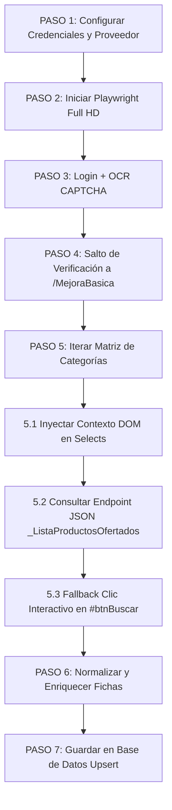

# 📘 GUÍA TÉCNICA: FUNCIONES PADRE DE AUTOMATIZACIÓN DE PERÚ COMPRAS
> **Módulo:** `automation/perucompras_core.py`  
> **Propósito:** Ofrecer una API en Python desacoplada al 100% de cualquier interfaz de usuario (UI), diseñada para ser importada y utilizada en cualquier proyecto (CLI, FastAPI, Django, Flask, Next.js backend, microservicios, etc.).

---

## 1. Arquitectura y Principios de Diseño

El sistema sigue la **Ley de Tesler** y el principio de **desacoplamiento total**: toda la complejidad técnica de automatización, manejo de Playwright, OCR de CAPTCHA, evasiones, peticiones AJAX y manipulación del DOM residen exclusivamente en las **Funciones Padre**.

```
                           ┌─────────────────────────────────────────┐
                           │      TU APLICACIÓN / PROYECTO WEB       │
                           │ (FastAPI, Flask, CLI, React, Next.js)  │
                           └────────────────────┬────────────────────┘
                                                │ Invoca API limpia
                                                ▼
┌──────────────────────────────────────────────────────────────────────────────────────────────┐
│                              MÓDULO CENTRAL PERUCOMPRAS_CORE                                 │
│                                (automation/perucompras_core.py)                              │
├───────────────────┬─────────────────────┬───────────────────┬────────────────────────────────┤
│ login_automatico  │ saltar_verificacion │ completar_dinamico│ consultar_json_productos       │
└─────────┬─────────┴──────────┬──────────┴─────────┬─────────┴───────────────┬────────────────┘
          │                    │                    │                         │
          ▼                    ▼                    ▼                         ▼
┌──────────────────────────────────────────────────────────────────────────────────────────────┐
│                              PORTAL WEB DE PERÚ COMPRAS                                      │
│                      (https://www.catalogos.perucompras.gob.pe)                              │
└──────────────────────────────────────────────────────────────────────────────────────────────┘
```

---

## 2. Requisitos Previos e Instalación

Para utilizar las Funciones Padre en cualquier proyecto Python, asegúrate de instalar las siguientes dependencias:

```bash
pip install playwright pytesseract pillow openpyxl
playwright install chromium
```

*(Es necesario tener Tesseract OCR instalado en el sistema operativo si se desea resolución automática de CAPTCHA).*

---

## 3. Catálogo Completo de Funciones Padre

### 🔑 1. `login_automatico`
Autenticación robusta en el portal con resolución automática de CAPTCHA vía Tesseract OCR y reintentos ilimitados.

```python
login_automatico(
    page,                           # Instancia de Playwright Page
    usuario: str,                   # Usuario del proveedor
    password: str,                  # Contraseña del proveedor
    captcha_bridge=None,            # (Opcional) Puente para resolución manual en UI
    stop_event=None,                # (Opcional) threading.Event para cancelación
    log_func: Callable[[str], None] # (Opcional) Callback de logs
) -> bool
```
- **Características clave:** Configura automáticamente el viewport a **1920x1080 (Full HD)** para evitar la deformación del CAPTCHA `#imgCaptcha`. Reintenta indefinidamente hasta que el login sea exitoso o el usuario cancele la operación.

---

### 🔄 2. `saltar_verificacion`
Maniobra de retroceso seguro e inicio de sesión fresco para evitar bloqueos o modales de expiración.

```python
saltar_verificacion(
    page, 
    log_func: Callable[[str], None] = None
) -> bool
```
- **Secuencia atómica:**
  1. `page.go_back()` (retrocede 1 paso en el historial).
  2. Navega a `https://www.catalogos.perucompras.gob.pe`.
  3. Navega y valida la carga de `https://www.catalogos.perucompras.gob.pe/MejoraBasica`.

---

### 📍 3. `navegar_mejora_basica`
Navegación directa a la sección de Catálogos y Mejora de Existencias.

```python
navegar_mejora_basica(
    page, 
    log_func: Callable[[str], None] = None
) -> bool
```
- **Retorno:** `True` si la página `MejoraBasica` cargó y sus elementos están listos en el DOM.

---

### 📋 4. `completar_menu_dinamico`
Selección flexible en los dropdowns HTML de catálogo + disparo automático del botón **`Iniciar Búsqueda` (`#btnBuscar`)**.

```python
completar_menu_dinamico(
    page,
    acuerdo: str,                  # Ej: "EXT-CE-2022-5 COMPUTADORAS Y ESCÁNERES"
    catalogo: str,                 # Ej: "COMPUTADORAS DE ESCRITORIO"
    categoria: str,                # Ej: "COMPUTADORA TODO EN UNO"
    log_func: Callable[[str], None] = None
) -> bool
```
- **Características clave:**
  - Realiza coincidencia flexible (insensible a tildes, espacios extra y mayúsculas/minúsculas).
  - Reintenta hasta 6 veces esperando que las peticiones AJAX del portal pueblen los subcombos.
  - Dispara automáticamente el clic en **`Iniciar Búsqueda` (`#btnBuscar`)** para generar la tabla DataTables de productos.

---

### 📦 5. `insertar_stock_item`
Búsqueda y actualización puntual de stock de un producto.

```python
insertar_stock_item(
    page,
    nro_parte: str,                # Número de parte o código del producto
    nuevo_stock: int,              # Nueva cantidad de existencias
    pausa: float = 2.0,            # Pausa tras guardar
    log_func: Callable[[str], None] = None
) -> dict                          # {"exito": bool, "parte": str, "stock": int, "mensaje": str}
```
- **Características clave:** Espera activa de hasta 20 segundos por la inyección AJAX del input editable dentro del modal de existencias, evitando fallos por latencia de los servidores del gobierno.

---

### 📡 6. `consultar_json_productos`
Extracción del dataset crudo JSON de fichas ofertadas en tiempo real.

```python
consultar_json_productos(
    page,
    n_acuerdo: int,                # ID de acuerdo (Ej: 249)
    n_catalogo: int,               # ID de catálogo (Ej: 252)
    n_categoria: int,              # ID de categoría (Ej: 11736)
    log_func: Callable[[str], None] = None
) -> List[Dict[str, Any]]          # Lista con miles de productos en formato JSON crudo
```
- **Características clave:** Ejecuta una petición `fetch` interna en el navegador con las cookies activas de la sesión `ASP.NET_SessionId`, retornando el dataset sin depender del renderizado HTML.

---

## 4. Ejemplos de Integración en Otros Proyectos

### 🐍 Ejemplo 1: Script Autónomo / CLI en Python

```python
import time
from automation.browser import init_browser, close_browser
from automation.perucompras_core import (
    login_automatico,
    saltar_verificacion,
    completar_menu_dinamico,
    consultar_json_productos
)

def mi_bot_personalizado():
    # 1. Iniciar Playwright Chromium (modo visible u oculto)
    pw, browser, page = init_browser(headless=False)

    try:
        # 2. Login con Función Padre
        if login_automatico(page, "MI_USUARIO", "MI_CLAVE", log_func=print):
            
            # 3. Maniobra a MejoraBasica
            saltar_verificacion(page, log_func=print)
            
            # 4. Filtros dinámicos
            completar_menu_dinamico(
                page, 
                acuerdo="EXT-CE-2022-5 COMPUTADORAS Y ESCÁNERES",
                catalogo="COMPUTADORAS DE ESCRITORIO",
                categoria="COMPUTADORA TODO EN UNO",
                log_func=print
            )

            # 5. Consultar dataset crudo JSON de fichas
            fichas = consultar_json_productos(page, n_acuerdo=249, n_catalogo=252, n_categoria=11736)
            print(f"🎉 ¡Extraídas {len(fichas)} fichas con éxito!")

    finally:
        close_browser(pw, browser)

if __name__ == "__main__":
    mi_bot_personalizado()
```

---

### ⚡ Ejemplo 2: Backend Web API con FastAPI (Para Proyectos Web / Next.js / React)

Para usar las Funciones Padre en un servidor web API que atienda peticiones de un frontend moderno:

```python
# main_api.py (Servidor FastAPI)
from fastapi import FastAPI, BackgroundTasks, HTTPException
from pydantic import BaseModel
from automation.browser import init_browser, close_browser
from automation.perucompras_core import (
    login_automatico,
    saltar_verificacion,
    completar_menu_dinamico,
    consultar_json_productos
)

app = FastAPI(title="Servicio de Automatización Perú Compras")

class AuditRequest(BaseModel):
    usuario: str
    password: str
    acuerdo: str
    catalogo: str
    categoria: str
    n_acuerdo: int
    n_catalogo: int
    n_categoria: int

@app.post("/api/v1/auditar-catalogo")
def api_auditar_catalogo(req: AuditRequest):
    """Endpoint REST para ser invocado desde cualquier Web App (React, Vue, Next.js)."""
    pw, browser, page = init_browser(headless=True) # Modo headless para servidor VPS
    
    logs = []
    def web_logger(msg: str):
        logs.append(msg)
        print(f"[API LOG] {msg}")

    try:
        # Paso 1: Login
        ok = login_automatico(page, req.usuario, req.password, log_func=web_logger)
        if not ok:
            raise HTTPException(status_code=401, detail="Error de autenticación en Perú Compras")

        # Paso 2: Retroceso / Evasión
        saltar_verificacion(page, log_func=web_logger)

        # Paso 3: Aplicar desplegables en el portal
        completar_menu_dinamico(page, req.acuerdo, req.catalogo, req.categoria, log_func=web_logger)

        # Paso 4: Extracción JSON cruda
        fichas = consultar_json_productos(page, req.n_acuerdo, req.n_catalogo, req.n_categoria, log_func=web_logger)

        return {
            "status": "success",
            "total_fichas": len(fichas),
            "data": fichas[:50], # Devuelve las primeras 50 fichas como muestra JSON
            "logs": logs
        }

    finally:
        close_browser(pw, browser)
```

---

## 5. Extensiones y Adaptaciones para Entornos Web / Cloud

1. **Modo Headless en Servidor:**
   En entornos de servidor (VPS, AWS EC2, Google Cloud, Docker) pasa el argumento `headless=True` a `init_browser(headless=True)`.
2. **WebSocket / Polling de Logs en Tiempo Real:**
   Puedes pasar una función callback `log_func` que acumule logs y emita screenshots en base64 para que el usuario supervise la extracción en vivo.
3. **Manejo de CAPTCHA:**
   Se extrae el CAPTCHA directamente del Canvas HTML5 (`#imgCaptcha`) para máxima resolución OCR con PyTesseract sin distorsión de pantalla.

---

## 6. 🚀 RECETA MAESTRA: PIPELINE DE 7 PASOS REUTILIZABLE

Para cualquier nuevo módulo o catálogo de Perú Compras, replica esta estructura estándar de 7 pasos:



### Plantilla de Código para Copiar y Modificar:

```python
import asyncio
from playwright.async_api import async_playwright
from app.services.perucompras_core import login_automatico, saltar_verificacion, consultar_json_productos, _parse_html_products_partial

async def extraer_catalogo_generico(usuario: str, password: str, ruc: str, nombre_proveedor: str, lista_combos: list, db_session=None):
    """
    PLANTILLA BASE PARA CUALQUIER SCRAPER DE PERÚ COMPRAS
    =====================================================
    Modifica únicamente 'lista_combos' y la lógica de persistencia.
    """
    # -------------------------------------------------------------
    # PASO 1: Configuración
    # -------------------------------------------------------------
    print(f"🏢 [PASO 1] Proveedor: {nombre_proveedor} (RUC: {ruc})")

    async with async_playwright() as p:
        # ---------------------------------------------------------
        # PASO 2: Motor Playwright Headless Full HD
        # ---------------------------------------------------------
        browser = await p.chromium.launch(headless=True)
        context = await browser.new_context(viewport={'width': 1920, 'height': 1080})
        page = await context.new_page()

        # ---------------------------------------------------------
        # PASO 3: Login con OCR de CAPTCHA
        # ---------------------------------------------------------
        ok = await login_automatico(page, usuario, password, max_retries=6)
        if not ok:
            print("❌ [PASO 3] Error de autenticación.")
            await browser.close()
            return []

        # ---------------------------------------------------------
        # PASO 4: Evasión de modales y entrada a /MejoraBasica
        # ---------------------------------------------------------
        await saltar_verificacion(page)

        # ---------------------------------------------------------
        # PASO 5: Iteración sistemática de combinaciones
        # ---------------------------------------------------------
        todos_los_productos = []

        for combo in lista_combos:
            n_acuerdo = combo["n_acuerdo"]
            n_catalogo = combo["n_catalogo"]
            n_categoria = combo["n_categoria"]

            # PASO 5.1: Establecer contexto en DOM
            await page.evaluate("""({acuerdo, catalogo, categoria}) => {
                const selAc = document.querySelector('#ajaxAcuerdo');
                if (selAc) { selAc.value = acuerdo; selAc.dispatchEvent(new Event('change', { bubbles: true })); }
                const selCat = document.querySelector('#ajaxCatalogo');
                if (selCat) { selCat.value = catalogo; selCat.dispatchEvent(new Event('change', { bubbles: true })); }
                const selCateg = document.querySelector('#ajaxCategoria');
                if (selCateg) { selCateg.value = categoria; selCateg.dispatchEvent(new Event('change', { bubbles: true })); }
            }""", {"acuerdo": n_acuerdo, "catalogo": n_catalogo, "categoria": n_categoria})
            await page.wait_for_timeout(300)

            # PASO 5.2: Consulta JSON directa
            products = await consultar_json_productos(page, int(n_acuerdo), int(n_catalogo), int(n_categoria))

            # PASO 5.3: Fallback interactivo si no retorna JSON
            if not products:
                try:
                    await page.click("#btnBuscar", timeout=4000)
                    await page.wait_for_timeout(3000)
                    dom_html = await page.evaluate("() => document.querySelector('#OfertasPanelDiv')?.innerHTML || ''")
                    if dom_html:
                        products = _parse_html_products_partial(dom_html)
                except Exception:
                    pass

            # -----------------------------------------------------
            # PASO 6: Enriquecer metadatos
            # -----------------------------------------------------
            for prod in (products or []):
                prod["ruc_proveedor"] = ruc
                prod["nombre_proveedor"] = nombre_proveedor
                prod["catalogo"] = combo.get("catalogo_nombre", "")
                prod["categoria"] = combo.get("categoria_nombre", "")
                todos_los_productos.append(prod)

            # -----------------------------------------------------
            # PASO 7: Persistencia en BD (opcional)
            # -----------------------------------------------------
            # if db_session and products:
            #     upsert_ofertas_history_db(db_session, products)

        await browser.close()
        return todos_los_productos
```
